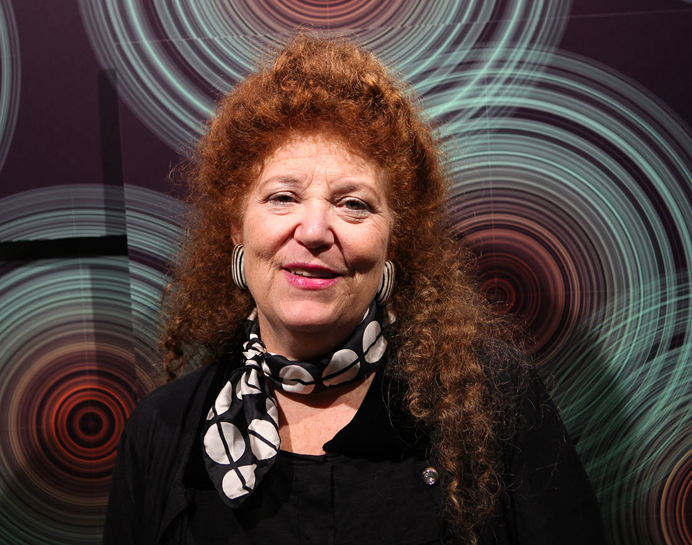

<link rel="shortcut icon" type="image/x-icon" href="favicon.ico">

 
<em>sculpture television buddha (after Something Pacific) by Robert Twomey</em>

## Bridging the Gap between Subjective and Computational Measurements of Machine Creativity for [CVPR 2021](http://cvpr2021.thecvf.com/)
### June 20, 2021, 11:00am – 2:30pm EDT 

[Speakers](#invited-speakers) | [Artworks](http://cmmc-cvpr21.com/artworks) | [Schedule](#schedule-edt) | [Questions](#questions) | [Participants](#participants) | [Metrics](#metrics) | [Organizers](#organizers)

CVPR 2021 is a virtual event and this workshop will be conducted online. Our invited speakers will provide prerecorded video talks and participate in live panel discussions.

# Introduction
While the methods for producing machine creativity have significantly improved, the discussion on a scientific consensus on measuring the creative abilities of machines has only begun.  As Artificial Intelligence becomes capable of solving more abstract and advanced problems (e.g., image synthesis, cross-modal translations), how do we measure the creative performance of a machine?  In the world of visual art, subjective evaluations of creativity have been discussed at length. In the CVPR community, by comparison, evaluating a creative method has not been as systematized. Our goal in this workshop is to discuss current methods for measuring creativity both from experts in creative artificial intelligence as well as artists.  We do not wish to narrow the gap between how humans evaluate creativity and how machines do, instead we wish to understand the differences and create links between the two such that our machine creativity methods improve.

# Format
This workshop will consist of a combination of expert panelists discussing key questions in measuring creativity, breakout sessions amongst attendees drawing on their disciplinary expertise, and an interactive evaluation of artworks submitted to the workshop.  We have gathered a list of experts in creative computer vision and visual art who are interested in discussing their own methods of measuring creativity and hearing how others do so.  These guest speakers will engage in a panel discussion and a question and answer session.  

# Invited Speakers 
<!-- __Participant Name__ (Affiliation(s), [website.com](website.com)) -->

<!-- Embedded youtube video of pre-recorded talk (see html comments/.md for example) -->
<!--iframe width="560" height="315" src="https://www.youtube.com/embed/xQvbM5iRXp8" frameborder="0" allow="accelerometer; autoplay; clipboard-write; encrypted--media; gyroscope; picture-in-picture" allowfullscreen></iframe-->

<!--  -->

[__David Bau__](https://people.csail.mit.edu/davidbau/home/) received his A.B. in Mathematics from Harvard, his M.S. in Computer Science from Cornell, and is completing his Ph.D. in EECS at MIT.  David has pioneered methods for the dissection, visualization, and interactive manipulation of deep networks in computer vision, and he is the creator of Network Dissection and GAN Paint, which enable a person to directly edit the internals of state-of-the-art neural networks.  David is coauthor of a widely-used graduate textbook, Numerical Linear Algebra.  Previous to his research at MIT he was an engineer at Google where he built Image Search ranking algorithms, Hangouts realtime communications, and the Pencil Code educational programming system.  David plans to begin as Assistant Professor at Northeastern Khoury school of computer science next year.

<iframe width="560" height="315" src="https://www.youtube.com/embed/TkL5wJeDGXE" title="YouTube video player" frameborder="0" allow="accelerometer; autoplay; clipboard-write; encrypted-media; gyroscope; picture-in-picture" allowfullscreen></iframe>

<!--
 -->

[__Kazjon Grace__](https://kazjon.com/) is the director of the Designing with AI Lab at the University of Sydney’s School of Architecture, Design and Planning. His work explores how intelligent interactive systems can be part of the creative decision-making process, with a particular focus on computational models of surprise, curiosity and interpretation.  He is currently an ARC DECRA Fellow leading a project to use methods from Creative AI to encourage people to diversify their diets and thus eat more healthily.

<iframe width="560" height="315" src="https://www.youtube.com/embed/Epsuw7gLaWk" title="YouTube video player" frameborder="0" allow="accelerometer; autoplay; clipboard-write; encrypted-media; gyroscope; picture-in-picture" allowfullscreen></iframe>

[__Ali Jahanian__](http://people.csail.mit.edu/jahanian/)

Presentation will be available soon!

[__Kristen Grauman__](https://www.cs.utexas.edu/users/grauman/) is a Professor in the Department of Computer Science at the University of Texas at Austin and a Research Scientist in Facebook AI Research (FAIR).  Her research in computer vision and machine learning focuses on visual recognition, video, and embodied perception.  Before joining UT-Austin in 2007, she received her Ph.D. at MIT.  She is an IEEE Fellow, AAAI Fellow, Sloan Fellow, and recipient of the 2013 Computers and Thought Award.  She and her collaborators have been recognized with several Best Paper awards in computer vision, including a 2011 Marr Prize and a 2017 Helmholtz Prize (test of time award).  She serves as an Associate Editor-in-Chief for PAMI and previously served as a Program Chair of CVPR 2015 and NeurIPS 2018.

<iframe width="560" height="315" src="https://www.youtube.com/embed/x1qJvUM5FOs" title="YouTube video player" frameborder="0" allow="accelerometer; autoplay; clipboard-write; encrypted-media; gyroscope; picture-in-picture" allowfullscreen></iframe>

<!--  -->

<!--  -->

[__Ellen Pearlman__](https://thoughtworksarts.io/bio/ellen-pearlman/) is a new media artist, curator and critic. A current Research Fellow at MIT, she is also a Senior Researcher Assistant Professor at RISEBA University in Latvia, as well as Director of ThoughtWorks Arts, a global innovation and research lab, and President of Art-A-Hack(TW) a rapid prototyping collaborative workshop. Ellen is a Fulbright Specialist in Art, Media and Technology, a Zero1 American Arts Incubator/U.S. State Department artist, and a U.S. Alumni Ties (Fulbright) grantee. She received her PhD from the School of Creative Media, Hong Kong City University where her thesis was awarded highest global honors by Leonardo LABS Abstracts. Ellen created "Noor: A Brainwave Opera", an interactive immersive work in a 360 degree theater in Hong Kong, and "AIBO: An Emotionally Intelligent Artificial Intelligence Brainwave Opera" at the Estonian Academy of Music. 

<iframe width="560" height="315" src="https://www.youtube.com/embed/d40jlWR5MdE" title="YouTube video player" frameborder="0" allow="accelerometer; autoplay; clipboard-write; encrypted-media; gyroscope; picture-in-picture" allowfullscreen></iframe>

<!--  -->

[__Mark Riedl__](https://www.cc.gatech.edu/people/mark-riedl) is a Professor in the Georgia Tech School of Interactive Computing and Associate Director of the Georgia Tech Machine Learning Center. Dr. Riedl’s research focuses on human-centered artificial intelligence—the development of artificial intelligence and machine learning technologies that understand and interact with human users in more natural ways. Dr. Riedl’s recent work has focused on story understanding and generation, computational creativity, explainable AI, and teaching virtual agents to behave safely. His research is supported by the NSF, DARPA, ONR, the U.S. Army, U.S. Health and Human Services, Disney, and Google. He is the recipient of a DARPA Young Faculty Award and an NSF CAREER Award.

<iframe width="560" height="315" src="https://www.youtube.com/embed/PqhdpvLfWNU" title="YouTube video player" frameborder="0" allow="accelerometer; autoplay; clipboard-write; encrypted-media; gyroscope; picture-in-picture" allowfullscreen></iframe>

<!--  -->

[__Carolyn Rose__](http://www.cs.cmu.edu/~cprose/) is a Professor of Language Technologies and Human-Computer Interaction in the School of Computer Science at Carnegie Mellon University.  Her research program focuses on computational modeling of discourse to enable scientific understanding the social and pragmatic nature of conversational interaction of all forms, and using this understanding to build intelligent computational systems for improving collaborative interactions.  Her research group’s highly interdisciplinary work, published in over 270 peer reviewed publications, is represented in the top venues of 5 fields: namely, Language Technologies, Learning Sciences, Cognitive Science, Educational Technology, and Human-Computer Interaction, with awards in 3 of these fields.  She is a Past President and Inaugural Fellow of the International Society of the Learning Sciences, Senior member of IEEE, Founding Chair of the International Alliance to Advance Learning in the Digital Era, and Co-Editor-in-Chief of the International Journal of Computer-Supported Collaborative Learning.  She also serves as a 2020-2021 AAAS Fellow under the Leshner Institute for Public Engagement with Science, with a focus on public engagement with Artificial Intelligence.  

<iframe width="560" height="315" src="https://www.youtube.com/embed/v6hg0CUdG7E" title="YouTube video player" frameborder="0" allow="accelerometer; autoplay; clipboard-write; encrypted-media; gyroscope; picture-in-picture" allowfullscreen></iframe>

<!-- &nbsp;&nbsp;&nbsp;&nbsp;&nbsp;&nbsp; -->

[__Kenneth Stanley__](https://www.cs.ucf.edu/~kstanley/) leads a research team at OpenAI on the challenge of open-endedness. He was previously Charles Millican Professor of Computer Science at the University of Central Florida and was also a co-founder of Geometric Intelligence Inc., which was acquired by Uber to create Uber AI Labs, where he was head of Core AI research.  He received a B.S.E. from the University of Pennsylvania in 1997 and received a Ph.D. in 2004 from the University of Texas at Austin.  He is an inventor of the Neuroevolution of Augmenting Topologies (NEAT), HyperNEAT, novelty search, and POET algorithms, as well as the CPPN representation, among many others.  His main research contributions are in neuroevolution (i.e. evolving neural networks), generative and developmental systems, coevolution, machine learning for video games, interactive evolution, quality diversity, and open-endedness. He has won best paper awards for his work on NEAT, NERO, NEAT Drummer, FSMC, HyperNEAT, novelty search, Galactic Arms Race, POET, and MCC. His original 2002 paper on NEAT also received the 2017 ISAL Award for Outstanding Paper of the Decade 2002 - 2012 from the International Society for Artificial Life. He is a coauthor of the popular science book, "Why Greatness Cannot Be Planned: The Myth of the Objective" (published by Springer), and has spoken widely on its subject.  

<iframe width="560" height="315" src="https://www.youtube.com/embed/aLCJm7M9lOw" title="YouTube video player" frameborder="0" allow="accelerometer; autoplay; clipboard-write; encrypted-media; gyroscope; picture-in-picture" allowfullscreen></iframe>

 
<!-- [__Jessica Hodgins__](https://www.cs.cmu.edu/~jkh/), CMU/FAIR -->

# Participating Artists

[__Gallery__](http://cmmc-cvpr21.com/artworks)

- [The Ear by Esteban Y Agosin](http://cmmc-cvpr21.com/artworks#agosin)
- [Zen Machine by Neo Christopher Chung](http://cmmc-cvpr21.com/artworks#chung)
- [Jungle in the Tiger by Chrisantha Fernando](http://cmmc-cvpr21.com/artworks#fernando)
- [Furry Cars by Utkarsh Ojha](http://cmmc-cvpr21.com/artworks#ojha)
- [In The Bleak Midwinter by Glenn Marshall](http://cmmc-cvpr21.com/artworks#marshall)
- [Models for Environmental Literacy by Tivon Rice](http://cmmc-cvpr21.com/artworks#rice)
- [Permanent Visibility by Nica Ross](http://cmmc-cvpr21.com/artworks#ross)
- [Tunes from the Ai Frontiers by Bob L.T. Sturm](http://cmmc-cvpr21.com/artworks#sturm)
- [AI Helper 002 by Maksim Surguy](http://cmmc-cvpr21.com/artworks#surguy)
- [Synthetic Still Life by Ivona Tautkute](http://cmmc-cvpr21.com/artworks#tautkute)
- [Mezs by Rihards Vitols](http://cmmc-cvpr21.com/artworks#vitols)

# Schedule (EDT)
<!-- online videos: invited speaker talks, participants will watch it beforehand -->
Participants are strongly recommended to watch the invited talks before the interactive session. 

| Time &nbsp; &nbsp; &nbsp; &nbsp; &nbsp; &nbsp; &nbsp; &nbsp; &nbsp;| Activity | Location | 
| ---- | ---- | ---- |
| 11:00 - 11:20 | Introduction (20 min) | main room | 
| 11:20 - 11:50 | Discussion 1 - Elements of Creative AI (30 min) | breakout rooms |
| 11:50 - 12:05 | Q & A (15 min) | main room |
| 12:05 - 12:35 | Discussion 2 - Evaluating ML/Art Projects (30 min) | breakout rooms |
| 12:35 - 12:50 | Q & A (15 min) | main room |
| 12:50 - 13:30 | Guest Speaker Panel (40 min) | main room |
| 13:30 - 14:00 | Discussion 3 - Revising Metrics, Evaluation 2 (30 min) | breakout rooms |
| 14:10 - 14:30 | Presentation of Results and Wrap up | main room | 

# Questions

### To be discussed with the panelists

What are your methods and metrics for evaluating the creativity of artificial or human intelligence that you and your colleagues have developed?

Do you think that it is valuable to measure creativity? In what ways has measuring creativity helped creative output?

[For Artists] How does the study of creative AI systems inform human creative practice? [For Engineers] How does human creativity influence computational models of creativity? 

Do you think there is an inherent difference between creative AI and human creativity? What would be the difference? If not, why not.

Are all generative systems “creative”? or… Is there a meaningful distinction between generativity and creativity?

How do we attribute (who is responsible for) the creativity in collaborative creative systems?

<!-- 

# Call for Participation

We offer two ways for participation.

__Call for Participation in the Live, Active Breakout session__

In this interactive workshop, participants will discuss thought-provoking topics of Creative AI. For instance, how do we evaluate the artifacts created by AI systems? What are the metrics for measuring creativity? Participants in this workshop will engage in breakout room discussions to collaboratively find answers to these questions. This interdisciplinary workshop aims to provide a platform for the researchers in computer vision, machine learning, or AI in general, to meet artists, writers, and performers to discuss and share their views on the subject of creativity and intelligence. The discussions will draw from concrete examples from a variety of creative domains, including image generation, robots painting, and story generation. We aim to build on existing views from both artists and AI researchers to carve out interdisciplinary discourse on Creative AI.

Participation in this workshop is open to all CVPR attendees, however, space is limited to ensure that the live, active breakout sessions are productive. In order to reserve a spot for these sessions, please fill out the following Google Form by Saturday, May 1st, midnight Eastern.
[Participation Form](https://forms.gle/MMtx7zcNJyfUbNqNA)

__Call for Artwork__

This workshop is accepting submissions of computer vision artwork to form a virtual gallery exhibition.  The submissions will be evaluated for acceptance by a jury committee of artists.  These artworks will be featured in an online exhibition, and additionally will serve as  contemporary examples of machine creativity for workshop participants to discuss.  Guest speakers and attendees will evaluate these artworks during the workshop, applying the measures of machine creativity developed  earlier in the event.

If you are interested in submitting artwork, please use the following Google Form to send your work by Saturday, May 1st, midnight Eastern.
[Art Call Form](https://forms.gle/xTYSwdZPrUKKwv3x9) -->

<!--
Participants in this workshop, as a group, will examine a number of Artificial Intelligence (AI) Art projects, and articulate metrics to evaluate dimensions of creativity in those works. Workshop participants are key contributors to this research in Measuring Creative AI, and we plan for every participant to be named on future Measurable Creative AI publications (website, papers, etc.) as contributors. This is a novel research project with no prior examples as far as we know, and this workshop will be the inaugural event for this effort as this exercise has only been conducted with students previously.

__How to participate__: If you are interested to participate, please fill out the following google form by May 1st, 2021.

Form: [google form link](https://docs.google.com/forms/d/e/1FAIpQLSeAGeh5_nk2Y3Uu3zPIyUU_riHrAnSutdb1xUZcglrEsM_AWQ/viewform)

We will send out an acceptance notification by May 15th, 2021.
-->

# Participants
<!--
This session is an actual working session: together we will collaboratively define metrics for Creative AI. 

__Workshop Participant__ [This is their website/artwork/publication title](website.com)
-->
Participants will be updated as they are confirmed.

# Metrics
Coming soon.

<!--

Here is our metrics worksheet: [google docs](newmetricssheet.com)

We will publish our results after the workshop.
-->

# Organizers 
 
[__Ahmed Elgammal__](https://sites.rutgers.edu/ahmed-elgammal/) is a professor at the Department of Computer Science at Rutgers University. His research areas include data science in the domain of digital humanities. His work on knowledge discovery in art history and AI art generation received wide international media attention, and his art has been shown in several technology and art venues in Los Angeles, Frankfurt, San Francisco, and New York City.
 
[__Hyeju Jang__](https://www.cs.ubc.ca/~hyejuj/) is a postdoctoral fellow at the University of British Columbia. Her research interests include natural language processing, computational linguistics, discourse analysis, and text mining in various domains. She has been working on computationally modeling creative uses of language, such as metaphor, in order to capture how they are used in discourse context and identify a broader spectrum of predictors that contribute towards their detection and generation. 
 
[__Eunsu Kang__ ](Http://kangeunsu.com) is an artist, a researcher, and an educator who explores the intersection of art and machine learning as well as the possibility of creative AI. She started her artist career with video installations and single channel videos. She left her tenured art professor position to design and teach new courses (Art and Machine Learning, Creative AI) at the Machine Learning Department of Carnegie Mellon University. Recently she co-founded the [Women+ Art AI collective](https://womenart.ai/).

[__James McCann__](http://www.cs.cmu.edu/~jmccann/) is an Assistant Professor in the Carnegie Mellon Robotics Institute. He is interested in systems and interfaces that operate in real-time and build user intuition, including systems that enable and enhance creativity.
 
[__Jean Oh__](www.cs.cmu.edu/~jeanoh/) is a faculty member at the Robotics Institute at Carnegie Mellon University. She is passionate about creating robots that can collaborate with humans in shared or remote environments, continuously improving themselves through learning, exploration, and interactions. Jean co-designed a new graduate-level course on Creative AI at CMU and was a co-organizer of the first workshop on Measuring Computational Creativity at ISEA’20.
 
[__Devi Parikh__](https://www.cc.gatech.edu/~parikh/) is an Associate Professor in the School of Interactive Computing at Georgia Tech, and a Research Scientist at Facebook AI Research (FAIR). Her research interests are in computer vision, natural language processing, embodied AI, human-AI collaboration, and AI for creativity. Devi has co-organized workshops at CVPR since 2010. For instance, the series of [Visual Question Answering workshops](https://visualqa.org/workshop.html).

[__Peter Schaldenbrand__ ](https://pschaldenbrand.github.io/) is a graduate student and technical staff member at Carnegie Mellon University.  His research interests include creating machine learning models that perform creative tasks and artificial intelligence in education.  Recently, he has been focusing on a robot artistic painting project.

[__Robert Twomey__](roberttwomey.com) is an Assistant Professor of Emerging Media Arts at the University of Nebraska-Lincoln, and a Visiting Scholar with the Clarke Center for Human Imagination at UC San Diego. His work as an artist and engineer explores how emerging technologies transform sites of intimate life. He has presented his work at SIGGRAPH (Best Paper Award), the Museum of Contemporary Art San Diego, and has been supported by the National Science Foundation, the California Arts Council, Microsoft, Amazon, and NVIDIA. 
 
[__Jun-Yan Zhu__](https://www.cs.cmu.edu/~junyanz/) is an Assistant Professor in the School of Computer Science of Carnegie Mellon University. He studies computer vision, computer graphics, computational photography, and machine learning, with the goal of building intelligent machines, capable of recreating our visual world. Jun-Yan has co-organized several relevant workshops and tutorials including CVPR 2020 Tutorial on Neural Rendering, ICCV 2019 Workshop on Image and Video Synthesis, and CVPR 2018 Tutorial on Generative Adversarial Networks.

<!--
__Eunsu Kang__ is an artist, a researcher, and an educator who explores the intersection of art and machine learning, one of the core methods for building AI. Her works have been presented at conferences including ACM, ICMC, ISEA, SIGGRAPH Asia and NeurIPS. Kang earned her Ph.D. from DXARTS of the University of Washington, an MA from MAT, UCSB, and an MFA from Ewha Womans University. She was a tenured Associate Professor of New Media Art at the University of Akron and currently is a Visiting Professor of Art and Machine Learning at Carnegie Mellon University’s School of Computer Science. [kangeunsu.com](kangeunsu.com)

__Jean Oh__ is a faculty member at the [Robotics Institute at Carnegie Mellon University]([www.cs.cmu.edu/~jeanoh/]). Her research addresses the creativity in decision making in the problem domains including self-driving cars, disaster response, healthcare, and arts. Her team’s work won the Best Paper Award at the 2018 IEEE International Conference on Robotics and Automation, and also the Best Cognitive Robotics Paper Award at the IEEE International Conference on Robotics and Automation in 2015.  Jean received her Ph.D. in Language and Information Technologies at Carnegie Mellon University, M.S. in Computer Science at Columbia University, and B.S. in Biotechnology at Yonsei University.

__Robert Twomey__ is an artist and engineer exploring the poetic intersection of human and machine perception. He has presented his work at SIGGRAPH, the Museum of Contemporary Art San Diego, and his research has been supported by the National Science Foundation, Microsoft, Amazon, and NVIDIA. Twomey received his BS from Yale with majors in Art and Biomedical Engineering, his MFA from UC San Diego, and his PhD in DXARTS from the University of Washington. He is an Assistant Professor with the [Johnny Carson Center for Emerging Media Arts](carsoncenter.unl.edu) at the University of Nebraska-Lincoln, and a Visiting Scholar with the [Arthur C. Clarke Center for Human Imagination](imagination.ucsd.edu) at UC San Diego.
-->
<!-- # Support -->

<!--This workshop is made possible, in part, by generous support from the [Johnny Carson Center for Emerging Media Arts](carsoncenter.unl.edu).-->
